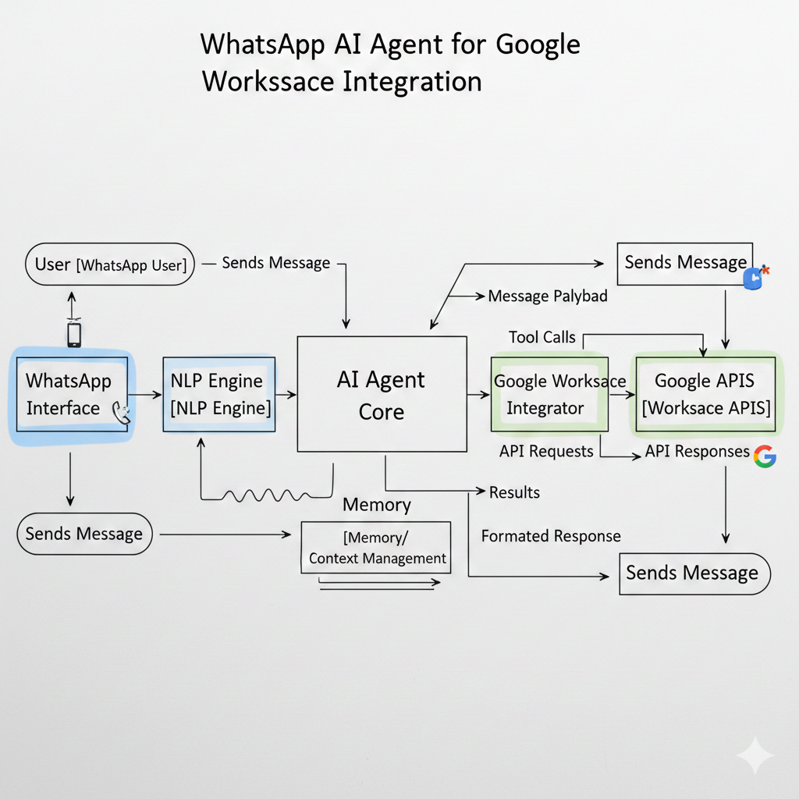

# 🚀 Workspace Navigator

**AI-Powered Google Workspace Assistant via WhatsApp**

Control your entire Google Workspace (Gmail, Calendar, Drive, Sheets) through natural language WhatsApp messages. Workspace Navigator is an intelligent AI agent that understands your requests and executes tasks on your behalf.



---

## 📋 Table of Contents

- [Features](#-features)
- [Architecture](#-architecture)
- [Tech Stack](#-tech-stack)
- [Prerequisites](#-prerequisites)
- [Installation](#-installation)
- [Configuration](#-configuration)
- [Usage](#-usage)
- [Available Commands](#-available-commands)
- [Project Structure](#-project-structure)
- [How It Works](#-how-it-works)
- [Security & Privacy](#-security--privacy)
- [Troubleshooting](#-troubleshooting)
- [Contributing](#-contributing)
- [License](#-license)

---

## ✨ Features

### 📧 **Gmail Management**
- Send emails with natural language commands
- Create and manage drafts
- Search emails using Gmail search syntax
- Read email content
- Delete/archive messages
- Add labels and organize inbox

### 📅 **Calendar Operations**
- Create events with smart date parsing
- List upcoming events
- Update existing events
- Delete events
- Handle recurring events

### 📁 **Google Drive**
- Search for files
- Share files with specific people
- List folder contents
- Create folders
- Delete files

### 📊 **Google Sheets**
- Read data from spreadsheets
- Write data to cells or ranges
- Update individual cells
- Append new rows

### 🧠 **Intelligent Features**
- **Natural Language Understanding**: Uses OpenAI's GPT-4 to interpret casual requests
- **Context Awareness**: Maintains conversation history for follow-up questions
- **Memory System**: 
  - Short-term: Recent conversation context
  - Working: Current task parameters
  - Long-term: User preferences and frequent contacts
- **Smart Clarification**: Asks for details when requests are ambiguous
- **Error Recovery**: Graceful error handling with user-friendly messages

---

## 🏗️ Architecture


### Component Breakdown

1. **WhatsApp Client** (`src/whatsapp/client.ts`)
   - Manages WhatsApp connection using Baileys library
   - Handles QR code authentication
   - Message parsing and routing
   - Supports both private and group chats (with @nav prefix)

2. **Agent Core** (`src/agent/core.ts`)
   - Central orchestrator
   - Routes messages to NLP engine
   - Executes tool calls
   - Manages conversation flow

3. **NLP Engine** (`src/nlp/engine.ts`)
   - Integrates with OpenAI GPT-4
   - Parses user intent from natural language
   - Generates structured tool calls
   - Returns clarification requests when needed

4. **Memory Manager** (`src/memory/manager.ts`)
   - **Short-term**: Last 10 conversation turns
   - **Working**: Current multi-step task state
   - **Long-term**: SQLite database for user profiles, preferences, and history

5. **Tool Registry** (`src/tools/registry.ts`)
   - Manages all available tools
   - Tools for Gmail, Calendar, Drive, and Sheets
   - Standardized execution interface

6. **Google Auth Manager** (`src/google/auth.ts`)
   - OAuth 2.0 flow
   - Token refresh handling
   - Automatic browser-based authorization

---

## 🛠️ Tech Stack

| Category | Technology |
|----------|-----------|
| **Runtime** | Node.js (v18+) |
| **Language** | TypeScript |
| **AI/NLP** | OpenAI GPT-4o |
| **WhatsApp** | @whiskeysockets/baileys |
| **Google APIs** | googleapis (v144+) |
| **Database** | SQLite (better-sqlite3) |
| **Logging** | Pino |
| **Build** | TypeScript Compiler |
| **Dev Tools** | ts-node, nodemon |

---

## 📦 Prerequisites

Before you begin, ensure you have:

1. **Node.js** (v18 or higher)
   ```bash
   node --version
   ```

2. **npm** (comes with Node.js)
   ```bash
   npm --version
   ```

3. **OpenAI API Key**
   - Sign up at [OpenAI](https://platform.openai.com/)
   - Generate an API key from your dashboard

4. **Google Cloud Project**
   - Create a project in [Google Cloud Console](https://console.cloud.google.com/)
   - Enable APIs: Gmail API, Calendar API, Drive API, Sheets API
   - Create OAuth 2.0 credentials (Desktop app)
   - Download client ID and client secret

5. **WhatsApp Account**
   - A valid WhatsApp account on your phone

---

## 🚀 Installation

### 1. Clone the Repository

```bash
git clone https://github.com/SAGARRAMBADE21/WHATSAPP_AI.git
cd WHATSAPP_AI
```

### 2. Install Dependencies

```bash
npm install
```

### 3. Configure Environment Variables

Copy the example environment file:

```bash
cp .env.example .env
```

Edit `.env` with your credentials:

```env
# OpenAI Configuration
OPENAI_API_KEY=sk-proj-...your-key-here
OPENAI_MODEL=gpt-4o

# Google OAuth Configuration
GOOGLE_CLIENT_ID=your-client-id.apps.googleusercontent.com
GOOGLE_CLIENT_SECRET=your-client-secret
GOOGLE_REDIRECT_URI=http://localhost:3000/oauth2callback
GOOGLE_TOKEN_PATH=./auth/google_tokens.json

# WhatsApp Configuration
ALLOWED_NUMBERS=1234567890,0987654321  # Optional: Restrict access
OWNER_NUMBER=1234567890  # Your WhatsApp number
AUTH_STATE_PATH=./auth/baileys_auth

# Memory & Storage
MEMORY_DB_PATH=./data/memory/navigator.db

# Logging
LOG_LEVEL=info
```

### 4. Build the Project

```bash
npm run build
```

---

## ⚙️ Configuration

### Google OAuth Setup

1. Go to [Google Cloud Console](https://console.cloud.google.com/)
2. Create a new project or select existing one
3. **Enable APIs**:
   - Gmail API
   - Google Calendar API
   - Google Drive API
   - Google Sheets API

4. **Create OAuth Credentials**:
   - Navigate to "APIs & Services" → "Credentials"
   - Click "Create Credentials" → "OAuth client ID"
   - Choose "Desktop app"
   - Download the credentials
   - Copy `client_id` and `client_secret` to `.env`

5. **Configure OAuth Consent Screen**:
   - Add your email as a test user
   - Add required scopes (the app will request these automatically)

### WhatsApp Setup

- The first time you run the app, it will display a QR code
- Scan it with WhatsApp (Menu → Linked Devices → Link a Device)
- Authentication persists in `./auth/baileys_auth`

### Access Control

To restrict access to specific phone numbers:

```env
ALLOWED_NUMBERS=1234567890,9876543210
```

Leave empty to allow all numbers:

```env
ALLOWED_NUMBERS=
```

---

## 🎮 Usage

### Quick Start

1. **Install dependencies**:
   ```bash
   npm install
   ```

2. **Build the project**:
   ```bash
   npm run build
   ```

3. **Start the application**:
   ```bash
   npm start
   ```

### Running the App

**Development Mode** (with auto-reload):
```bash
npm run dev
```

**Production Mode**:
```bash
npm start
```

### First Run

1. The app will validate your configuration
2. Open browser for Google authorization (automatic)
3. Grant permissions to Gmail, Calendar, Drive, Sheets
4. Scan WhatsApp QR code with your phone
5. Wait for "Workspace Navigator is Running" message

### Sending Commands

**Private Chat**: Just send a message
```
Send email to john@example.com with subject "Meeting Tomorrow" and body "Let's meet at 3 PM"
```

**Group Chat**: Use `@nav` prefix
```
@nav what are my meetings today?
```

---

## 📝 Available Commands

### Gmail Commands

| Command | Example |
|---------|---------|
| Send email | "Send email to alice@example.com about project status" |
| Create draft | "Draft an email to bob@example.com saying I'll be late" |
| Search emails | "Find emails from john about invoices" |
| Read email | "Read email with ID 18a2f3c4d5e6f7g8" |
| Delete email | "Delete email 18a2f3c4d5e6f7g8" |
| Add label | "Label email 18a2f3c4d5e6f7g8 as 'Important'" |

### Calendar Commands

| Command | Example |
|---------|---------|
| Create event | "Schedule meeting tomorrow at 3 PM with Team Sync as title" |
| List events | "What are my meetings today?" |
| Update event | "Move my 3 PM meeting to 4 PM" |
| Delete event | "Cancel my meeting with John" |

### Drive Commands

| Command | Example |
|---------|---------|
| Search files | "Find all PDFs about budget" |
| Share file | "Share document xyz with alice@example.com" |
| List folder | "List files in folder abc123" |
| Create folder | "Create folder named 'Q1 Reports'" |
| Delete file | "Delete file xyz123" |

### Sheets Commands

| Command | Example |
|---------|---------|
| Read data | "Read data from spreadsheet abc123, range Sheet1!A1:C10" |
| Write data | "Update cell B5 in spreadsheet abc123 to 'Complete'" |
| Add row | "Add row ['John', '25', 'Engineer'] to spreadsheet abc123" |

---

## 📁 Project Structure

```
whatsapp_slack/
├── src/
│   ├── agent/
│   │   └── core.ts              # Main agent orchestrator
│   ├── google/
│   │   └── auth.ts              # Google OAuth manager
│   ├── memory/
│   │   ├── manager.ts           # Memory orchestrator
│   │   ├── short-term.ts        # Recent conversation history
│   │   ├── working.ts           # Current task state
│   │   └── long-term.ts         # Persistent SQLite storage
│   ├── nlp/
│   │   └── engine.ts            # OpenAI integration
│   ├── tools/
│   │   ├── registry.ts          # Tool management
│   │   ├── gmail.ts             # Gmail operations
│   │   ├── calendar.ts          # Calendar operations
│   │   ├── drive.ts             # Drive operations
│   │   └── sheets.ts            # Sheets operations
│   ├── whatsapp/
│   │   └── client.ts            # WhatsApp connection
│   ├── types/
│   │   └── qrcode-terminal.d.ts # Type definitions
│   ├── config.ts                # Configuration loader
│   ├── types.ts                 # TypeScript interfaces
│   └── index.ts                 # Application entry point
├── auth/                        # Authentication data (gitignored)
│   ├── baileys_auth/            # WhatsApp session
│   └── google_tokens.json       # Google OAuth tokens
├── data/                        # Application data (gitignored)
│   └── memory/
│       └── navigator.db         # SQLite database
├── dist/                        # Compiled JavaScript (gitignored)
├── doc/                         # Documentation and diagrams
├── .env                         # Environment variables (gitignored)
├── .env.example                 # Environment template
├── package.json                 # Dependencies
├── tsconfig.json                # TypeScript configuration
└── README.md                    # This file
```

---

## 🔍 How It Works

### Message Flow

1. **User sends WhatsApp message**
   ```
   "Send email to alice@example.com about the report"
   ```

2. **WhatsApp Client receives and validates**
   - Checks if sender is authorized
   - Extracts text content
   - Removes @nav prefix if in group

3. **Agent Core processes**
   - Retrieves user profile from memory
   - Loads conversation history
   - Fetches relevant context from long-term memory

4. **NLP Engine interprets**
   - Sends to OpenAI with system prompt
   - Receives structured tool call:
   ```json
   {
     "tool_name": "gmail_send_email",
     "parameters": {
       "to": "alice@example.com",
       "subject": "Report",
       "body": "Here is the report you requested..."
     }
   }
   ```

5. **Tool Registry executes**
   - Finds `gmail_send_email` tool
   - Executes with Google API
   - Returns result

6. **Agent responds**
   - Formats success/error message
   - Saves to memory
   - Sends WhatsApp reply:
   ```
   ✅ Email sent successfully to alice@example.com
   Subject: "Report"
   ```

### Memory System

**Short-term Memory** (In-memory)
- Last 10 conversation turns
- Used for context in follow-up questions
- Example: "Send it to Bob too" → knows "it" refers to previous email

**Working Memory** (In-memory)
- Current multi-step task state
- Missing parameters from incomplete requests
- Session expires after 30 minutes of inactivity

**Long-term Memory** (SQLite)
- User profiles and preferences
- Tool call history
- Frequently contacted emails
- Semantic search for relevant context

---

## 🔒 Security & Privacy

### Authentication
- **WhatsApp**: Multi-file auth state (Baileys)
- **Google**: OAuth 2.0 with automatic token refresh
- **Access Control**: Optional phone number whitelist

### Data Storage
- **Local Only**: All data stored locally on your machine
- **No Cloud Storage**: Authentication tokens and memory database stay on your device
- **Encrypted Transit**: All API calls use HTTPS/TLS

### Best Practices
1. Never share your `.env` file
2. Keep `auth/` directory private
3. Regularly rotate API keys
4. Review Google OAuth permissions periodically
5. Use `ALLOWED_NUMBERS` in production

### Gitignore Protection
The following sensitive files are automatically excluded:
- `.env` (API keys and secrets)
- `auth/` (WhatsApp and Google tokens)
- `data/` (Memory database)
- `*.log` (Logs may contain sensitive info)

---

## 🐛 Troubleshooting

### Common Issues

**1. "OPENAI_API_KEY is required"**
- Solution: Add your OpenAI API key to `.env`
- Verify: `echo $OPENAI_API_KEY` (Linux/Mac) or `echo %OPENAI_API_KEY%` (Windows)

**2. "Google authentication failed"**
- Solution: Check `GOOGLE_CLIENT_ID` and `GOOGLE_CLIENT_SECRET` in `.env`
- Ensure redirect URI is `http://localhost:3000/oauth2callback`
- Enable required APIs in Google Cloud Console

**3. "WhatsApp disconnected"**
- Solution: Delete `auth/baileys_auth` folder and re-scan QR code
- Check your phone's WhatsApp has internet connection

**4. "Port 3000 is already in use"**
- Solution: Change `GOOGLE_REDIRECT_URI` to another port (e.g., 3001)
- Or kill process using port 3000

**5. "Unauthorized number"**
- Solution: Add your phone number to `ALLOWED_NUMBERS` in `.env`
- Format: Just digits, no +, spaces, or dashes

**6. "Message not processing"**
- In groups: Use `@nav` prefix
- Check logs for errors: `LOG_LEVEL=debug npm run dev`

### Debug Mode

Enable detailed logging:
```env
LOG_LEVEL=debug
```

View all message processing steps in console.

### Getting Help

1. Check logs in terminal
2. Review `.env` configuration
3. Verify Google API quotas in Cloud Console
4. Test OpenAI API key with a simple curl request

---

## 🤝 Contributing

Contributions are welcome! Here's how you can help:

### For Developers

1. **Fork the repository**
2. **Create a feature branch**
   ```bash
   git checkout -b feature/amazing-feature
   ```
3. **Make your changes**
   - Follow existing code style
   - Add TypeScript types
   - Update documentation

4. **Test thoroughly**
   ```bash
   npm run build
   npm run dev
   ```

5. **Commit your changes**
   ```bash
   git commit -m "Add amazing feature"
   ```

6. **Push and create Pull Request**
   ```bash
   git push origin feature/amazing-feature
   ```

### Feature Requests

- Open an issue with label `enhancement`
- Describe the feature and use case
- Include examples of how it would work

### Bug Reports

- Open an issue with label `bug`
- Include steps to reproduce
- Attach relevant logs (remove sensitive data!)

---

## 📄 License

This project is licensed under the MIT License. See `LICENSE` file for details.

---

## 🙏 Acknowledgments

- [Baileys](https://github.com/WhiskeySockets/Baileys) - WhatsApp Web API
- [OpenAI](https://openai.com/) - GPT-4 language model
- [Google](https://developers.google.com/) - Workspace APIs
- [Pino](https://getpino.io/) - Fast logging library

---


